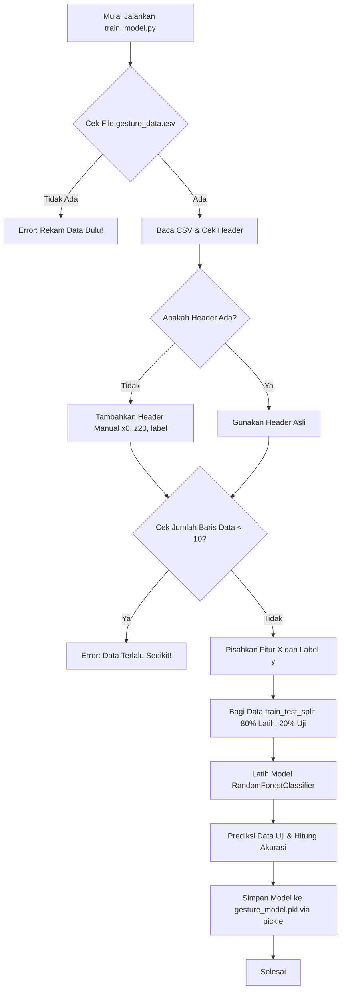

# Penjelasan Kode Sumber: `train_model.py`

Dokumen ini berisi penjelasan detail baris demi baris dari skrip Python `train_model.py`. Skrip ini digunakan untuk melatih model klasifikasi gestur tangan menggunakan algoritma Random Forest berdasarkan data koordinat landmark tangan yang telah direkam sebelumnya.

---

## Deskripsi & Tujuan File

Skrip `train_model.py` memiliki tujuan utama untuk:
1. Membaca data koordinat landmark tangan (21 landmark, masing-masing memiliki koordinat x, y, dan z) dari file CSV (`gesture_data.csv`).
2. Menyiapkan data dengan memisahkan koordinat fitur ($X$) dari label kategori ($y$).
3. Membagi data menjadi kumpulan data pelatihan (*training*) dan data pengujian (*testing*).
4. Melatih model klasifikasi menggunakan algoritma **Random Forest Classifier**.
5. Mengevaluasi performa model dengan menghitung nilai akurasi pada data pengujian.
6. Menyimpan model yang sudah terlatih ke dalam berkas biner (`gesture_model.pkl`) agar dapat langsung digunakan dalam program deteksi real-time.

---

## Daftar Import

Berikut adalah pustaka (libraries) yang diimpor pada skrip ini beserta fungsinya:

- **`pandas` (`pd`)**: Digunakan untuk membaca dataset `gesture_data.csv` ke dalam struktur tabel (DataFrame) serta memproses kolom data.
- **`train_test_split` (`sklearn.model_selection`)**: Digunakan untuk membagi dataset secara acak menjadi data latih dan data uji dengan rasio tertentu (dalam hal ini 80:20).
- **`RandomForestClassifier` (`sklearn.ensemble`)**: Algoritma pembelajaran mesin berbasis *ensemble* pohon keputusan (*decision trees*) yang digunakan sebagai otak klasifikasi gestur tangan.
- **`accuracy_score` (`sklearn.metrics`)**: Berfungsi untuk menghitung seberapa akurat prediksi model pada data uji dibandingkan dengan label sebenarnya.
- **`pickle`**: Pustaka standar Python untuk menyimpan objek model yang dilatih menjadi file fisik biner (`.pkl`) agar dapat dimuat kembali nanti tanpa perlu melatih ulang.
- **`os`**: Pustaka standar untuk berinteraksi dengan sistem operasi, seperti pengelolaan path berkas dan pengecekan keberadaan file.

---

## Penjelasan Baris Demi Baris

| Baris | Kode Sumber | Penjelasan |
| :---: | :--- | :--- |
| **1** | `import pandas as pd` | Mengimpor pustaka Pandas untuk manipulasi data tabular dan memberikan alias `pd` agar lebih singkat ditulis. |
| **2** | `from sklearn.model_selection import train_test_split` | Mengimpor fungsi pembagian dataset dari pustaka scikit-learn. |
| **3** | `from sklearn.ensemble import RandomForestClassifier` | Mengimpor kelas algoritma Random Forest Classifier untuk klasifikasi gestur. |
| **4** | `from sklearn.metrics import accuracy_score` | Mengimpor metrik evaluasi akurasi untuk menilai performa model. |
| **5** | `import pickle` | Mengimpor modul standard `pickle` untuk penyimpanan model ke dalam berkas biner. |
| **6** | `import os` | Mengimpor modul `os` untuk mengelola path direktori file data dan model. |
| **7** | *(Baris Kosong)* | Memberikan ruang kosong untuk keterbacaan kode (pemisah struktur). |
| **8** | `def train_gesture_model():` | Mendefinisikan fungsi utama bernama `train_gesture_model` yang akan menampung seluruh proses pelatihan model. |
| **9** | `    base_dir = os.path.dirname(os.path.abspath(__file__))` | Mendapatkan path direktori absolut tempat skrip `train_model.py` ini disimpan di dalam sistem. |
| **10** | `    data_path = os.path.join(base_dir, 'gesture_data.csv')` | Membuat path lengkap untuk file data gestur (`gesture_data.csv`) dengan menggabungkannya ke direktori dasar. |
| **11** | `    model_path = os.path.join(base_dir, 'gesture_model.pkl')` | Membuat path lengkap untuk berkas penyimpanan model (`gesture_model.pkl`). |
| **12** | *(Baris Kosong)* | Pemisah visual antara inisialisasi path dan validasi keberadaan file. |
| **13** | `    if not os.path.exists(data_path):` | Memeriksa apakah file dataset `gesture_data.csv` tidak ada di direktori yang ditentukan. |
| **14** | `        print(f"Error: File {data_path} tidak ditemukan. Rekam data dulu pakai train_data.py!")` | Menampilkan pesan kesalahan di terminal jika berkas dataset tidak ditemukan, memberi instruksi untuk merekam data terlebih dahulu. |
| **15** | `        return` | Menghentikan eksekusi fungsi karena tidak ada data yang bisa diproses untuk melatih model. |
| **16** | *(Baris Kosong)* | Pemisah visual sebelum memasuki tahap pemuatan data (*Load Data*). |
| **17** | `    # 1. Load Data` | Komentar penanda dimulainya tahap pertama: memuat dataset. |
| **18** | `    try:` | Memulai blok penanganan kesalahan (*try-except*) untuk mengantisipasi kegagalan pembacaan file. |
| **19** | `        # Coba baca baris pertama untuk cek apakah itu header` | Komentar penjelasan teknik pengecekan header pada file CSV. |
| **20** | `        df_check = pd.read_csv(data_path, nrows=0)` | Membaca file CSV sebanyak 0 baris (hanya memuat nama kolom/header) agar proses pengecekan lebih cepat. |
| **21** | `        if 'label' not in df_check.columns:` | Memeriksa apakah nama kolom `'label'` tidak ditemukan pada baris pertama file CSV tersebut. |
| **22** | `            print("Peringatan: Header tidak ditemukan. Menambahkan header manual.")` | Memberikan pesan peringatan ke terminal bahwa dataset tidak memiliki header kolom yang sesuai. |
| **23** | `            # 21 landmarks * 3 (x, y, z) + label = 64 kolom` | Komentar penjelasan struktur kolom: 21 titik koordinat tangan x, y, z ditambah 1 label sehingga berjumlah 64 kolom. |
| **24** | `            columns = [f'x{i}' for i in range(21)] + [f'y{i}' for i in range(21)] + [f'z{i}' for i in range(21)] + ['label']` | Membuat list nama kolom secara dinamis (`x0` s.d `x20`, `y0` s.d `y20`, `z0` s.d `z20`, dan kolom `'label'`). |
| **25** | `            df = pd.read_csv(data_path, header=None, names=columns)` | Membaca ulang berkas CSV tanpa mengasumsikan adanya header asli, lalu menerapkan nama kolom dari list `columns`. |
| **26** | `        else:` | Blok alternatif jika kolom `'label'` terdeteksi pada header CSV. |
| **27** | `            df = pd.read_csv(data_path)` | Membaca file CSV secara langsung dengan menggunakan baris pertama berkas sebagai header kolom. |
| **28** | `    except Exception as e:` | Menangkap semua jenis kegagalan/error yang terjadi pada saat membaca berkas CSV. |
| **29** | `        print(f"Error saat membaca file: {e}")` | Menampilkan pesan kegagalan membaca berkas secara mendetail ke layar terminal. |
| **30** | `        return` | Menghentikan fungsi karena data gagal dimuat. |
| **31** | `    ` | Baris kosong dengan spasi indentasi. |
| **32** | `    if len(df) < 10:` | Memeriksa apakah jumlah sampel data (baris) di dalam dataset kurang dari 10. |
| **33** | `        print("Error: Data terlalu sedikit untuk dilatih. Rekam lebih banyak data!")` | Menampilkan pesan error karena jumlah data terlalu minim untuk menghasilkan model pembelajaran yang andal. |
| **34** | `        return` | Menghentikan fungsi untuk mencegah error pada saat pembagian data latih. |
| **35** | *(Baris Kosong)* | Pemisah visual sebelum pembagian variabel fitur dan target. |
| **36** | `    # X adalah koordinat (semua kolom kecuali 'label'), y adalah label` | Komentar penjelas pembagian dataset menjadi fitur input ($X$) dan target output ($y$). |
| **37** | `    X = df.drop('label', axis=1)` | Membuat DataFrame fitur $X$ dengan cara menghapus kolom bernama `'label'` dari dataset (`axis=1` menandakan kolom). |
| **38** | `    y = df['label']` | Mengambil kolom `'label'` saja untuk disimpan ke dalam variabel target $y$. |
| **39** | *(Baris Kosong)* | Pemisah sebelum tahap pemisahan data latih dan uji (*Split Data*). |
| **40** | `    # 2. Split Data (Training & Testing)` | Komentar penanda tahap pembagian data. |
| **41** | `    X_train, X_test, y_train, y_test = train_test_split(X, y, test_size=0.2, random_state=42)` | Membagi data $X$ dan $y$ secara acak menjadi data pelatihan (80%) dan data pengujian (20%). `random_state=42` memastikan hasil pembagian selalu sama setiap kali dijalankan. |
| **42** | *(Baris Kosong)* | Pemisah sebelum proses pelatihan (*Train Model*). |
| **43** | `    # 3. Train Model (Random Forest)` | Komentar penanda tahap pelatihan model. |
| **44** | `    print("Sedang melatih model... Mohon tunggu.")` | Memberikan umpan balik teks ke terminal bahwa proses pelatihan sedang berlangsung. |
| **45** | `    model = RandomForestClassifier(n_estimators=100, random_state=42)` | Menginisialisasi objek model Random Forest Classifier dengan 100 pohon keputusan (`n_estimators=100`) dan pengacakan yang dikontrol (`random_state=42`). |
| **46** | `    model.fit(X_train, y_train)` | Melatih model menggunakan data latih (`X_train` sebagai input koordinat dan `y_train` sebagai labelnya). |
| **47** | *(Baris Kosong)* | Pemisah sebelum proses evaluasi model. |
| **48** | `    # 4. Evaluasi` | Komentar penanda bagian evaluasi model. |
| **49** | `    y_pred = model.predict(X_test)` | Melakukan prediksi label terhadap data uji (`X_test`) menggunakan model yang baru dilatih. |
| **50** | `    acc = accuracy_score(y_test, y_pred)` | Menghitung persentase keakuratan prediksi model dengan membandingkan nilai prediksi (`y_pred`) dan nilai asli (`y_test`). |
| **51** | `    print(f"Model berhasil dilatih dengan akurasi: {acc * 100:.2f}%")` | Menampilkan hasil akurasi model dalam format persentase dengan dua angka di belakang koma. |
| **52** | *(Baris Kosong)* | Pemisah sebelum proses penyimpanan model (*Simpan Model*). |
| **53** | `    # 5. Simpan Model` | Komentar penanda tahap akhir penyimpanan model. |
| **54** | `    with open(model_path, 'wb') as f:` | Membuka file biner untuk menulis (`'wb'`) pada lokasi `model_path` menggunakan blok `with` agar berkas tertutup secara otomatis setelah selesai. |
| **55** | `        pickle.dump(model, f)` | Menuliskan representasi biner objek `model` ke dalam berkas fisik menggunakan metode `dump` dari pustaka `pickle`. |
| **56** | `    print(f"Model disimpan di: {model_path}")` | Menampilkan pesan konfirmasi bahwa berkas model (`.pkl`) telah berhasil dibuat dan disimpan. |
| **57** | *(Baris Kosong)* | Pemisah visual sebelum penanganan modul utama Python. |
| **58** | `if __name__ == "__main__":` | Memastikan skrip dijalankan secara langsung (misalnya melalui terminal `python train_model.py`) dan bukan diimpor sebagai modul luar. |
| **59** | `    train_gesture_model()` | Memanggil fungsi utama `train_gesture_model()` untuk memulai alur pengerjaan. |
| **60** | *(Baris Kosong)* | Akhir berkas skrip Python. |

---

## Alur Kerja Utama

Proses yang dijalankan oleh skrip `train_model.py` dapat divisualisasikan dalam alur kerja terstruktur berikut:

1. **Inisialisasi & Pemeriksaan**: Program memastikan bahwa file data latih (`gesture_data.csv`) telah tersedia. Jika tidak, program meminta pengguna untuk merekam data gestur tangan terlebih dahulu.
2. **Prapemrosesan Data**:
   - Program memuat file CSV menggunakan Pandas.
   - Pengecekan dilakukan untuk memverifikasi apakah data memiliki baris header. Jika tidak, nama kolom secara otomatis dibuat (koordinat 21 titik landmark: `x0-x20`, `y0-y20`, `z0-z20`, dan kolom `label`).
   - Melakukan validasi jumlah sampel minimum (minimal 10 sampel).
3. **Pemisahan Variabel & Dataset**:
   - Memisahkan fitur masukan (koordinat landmark tangan) dengan membuang kolom `label`.
   - Mengambil kolom `label` sebagai kelas sasaran prediksi.
   - Menggunakan fungsi `train_test_split` untuk membagi data menjadi data pelatihan (80% sampel) dan data pengujian (20% sampel).
4. **Pelatihan & Evaluasi Model**:
   - Membuat pengklasifikasi Random Forest dengan konfigurasi 100 pohon keputusan.
   - Melatih model dengan data training (`X_train` dan `y_train`).
   - Mengevaluasi keandalan model menggunakan data testing (`X_test`), lalu membandingkan hasil prediksinya dengan kunci jawaban (`y_test`) untuk menghitung akurasi secara presisi.
5. **Penyimpanan Hasil**: Menyimpan model terlatih ke disk lokal dengan nama `gesture_model.pkl` menggunakan pustaka `pickle` agar bisa diintegrasikan langsung pada program pengenalan gestur secara real-time.
