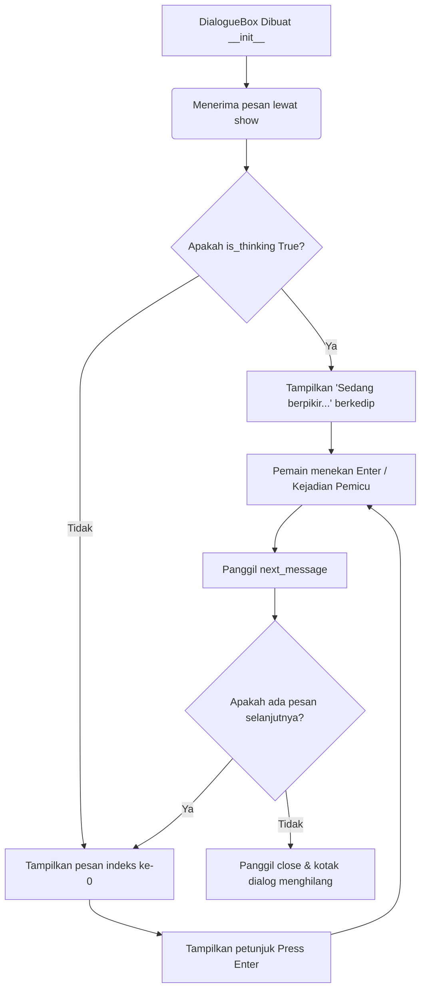

# Penjelasan Kode: `dialogue.py`

Dokumen ini berisi penjelasan detail baris demi baris untuk file `/home/abuyyy/PemogramanLanjut/src/ui/dialogue.py`. Penjelasan ini dibuat dalam bahasa Indonesia untuk membantu persiapan demo program.

---

## Deskripsi & Tujuan File
File `dialogue.py` mendefinisikan kelas `DialogueBox`. Kelas ini berfungsi untuk mengelola dan menampilkan kotak dialog (dialogue box) interaktif dalam permainan berbasis Pygame. Kotak dialog ini mendukung penampilan pesan bertahap (satu per satu), penutupan otomatis setelah pesan terakhir, indikator visual untuk kelanjutan dialog (`[Press Enter]`), serta status khusus "berpikir" (`is_thinking`) yang menampilkan teks dinamis berkedip ("Sedang berpikir...").

---

## Penjelasan Baris Demi Baris

Berikut adalah tabel penjelasan baris demi baris kode di dalam `dialogue.py`:

| Baris | Kode Sumber | Penjelasan |
| :---: | :--- | :--- |
| **1** | `import pygame` | Mengimpor modul `pygame` agar semua fitur grafis, teks, dan event Pygame dapat digunakan di dalam berkas ini. |
| **2** | `class DialogueBox:` | Deklarasi kelas `DialogueBox` untuk mengelompokkan data dan logika pengelolaan kotak dialog. |
| **3** | `    def __init__(self, font_size=18):` | Konstruktor kelas `DialogueBox` dengan parameter opsional `font_size` yang memiliki nilai default `18`. |
| **4** | `        self.font = pygame.font.SysFont("monospace", font_size)` | Membuat dan memuat objek font sistem berjenis *monospace* dengan ukuran sesuai parameter `font_size`. |
| **5** | `        self.active = False` | Menentukan status keaktifan kotak dialog. Jika `False`, kotak dialog tidak akan digambar di layar. |
| **6** | `        self.messages = []` | Inisialisasi daftar kosong (`list`) untuk menyimpan pesan-pesan teks yang akan ditampilkan. |
| **7** | `        self.current_index = 0` | Indeks penunjuk pesan yang saat ini sedang aktif (dimulai dari indeks `0` untuk pesan pertama). |
| **8** | `        self.box_rect = pygame.Rect(50, 450, 700, 120)` | Mendefinisikan objek `Rect` Pygame untuk menentukan batas kotak dialog: posisi X=50, Y=450, lebar=700, dan tinggi=120. |
| **9** | `        self.is_thinking = False` | Menambahkan variabel status berpikir untuk menandai apakah sistem sedang memproses sesuatu (misalnya memikirkan jawaban AI). |
| **10** | `    def show(self, messages, is_thinking=False):` | Mendefinisikan metode `show` untuk mengaktifkan kotak dialog dengan pesan tertentu dan status berpikir opsional. |
| **11** | `        if isinstance(messages, str):` | Memeriksa apakah parameter `messages` bertipe string tunggal (bukan list). |
| **12** | `            self.messages = [messages]` | Jika berupa string, bungkus string tersebut ke dalam list berisi satu elemen agar struktur data tetap konsisten. |
| **13** | `        else:` | Blok alternatif jika parameter `messages` bukan string tunggal (melainkan list/koleksi string). |
| **14** | `            self.messages = messages` | Menyimpan langsung list pesan ke dalam variabel `self.messages`. |
| **15** | `        self.current_index = 0` | Mengatur ulang penunjuk indeks ke `0` untuk memastikan dialog dimulai dari pesan pertama. |
| **16** | `        self.active = True` | Mengubah status kotak dialog menjadi aktif (`True`) agar mulai ditampilkan di layar. |
| **17** | `        self.is_thinking = is_thinking` | Menyetel nilai status berpikir sesuai dengan nilai parameter `is_thinking` yang dikirim. |
| **18** | `    def next_message(self):` | Mendefinisikan metode `next_message` untuk berlanjut ke pesan berikutnya dalam antrean. |
| **19** | `        self.current_index += 1` | Meningkatkan indeks pesan aktif sebesar 1 untuk bergeser ke pesan selanjutnya. |
| **20** | `        if self.current_index >= len(self.messages):` | Memeriksa apakah indeks saat ini sudah sama atau melebihi jumlah pesan dalam list. |
| **21** | `            self.close()` | Jika pesan sudah habis, panggil metode `close()` untuk menutup kotak dialog. |
| **22** | `            return False` | Mengembalikan `False` untuk memberi tahu pemanggil bahwa dialog telah selesai/ditutup. |
| **23** | `        return True` | Mengembalikan `True` jika masih ada pesan selanjutnya yang berhasil ditampilkan. |
| **24** | `    def close(self):` | Mendefinisikan metode `close` untuk menutup kotak dialog secara manual. |
| **25** | `        self.active = False` | Mengubah status keaktifan kotak dialog menjadi tidak aktif (`False`). |
| **26** | `        self.messages = []` | Mengosongkan daftar pesan yang sebelumnya tersimpan. |
| **27** | `        self.current_index = 0` | Mengatur ulang indeks pesan aktif kembali ke `0`. |
| **28** | `    def draw(self, screen):` | Mendefinisikan metode `draw` untuk menggambar seluruh elemen visual kotak dialog pada permukaan `screen`. |
| **29** | `        if self.active and self.messages:` | Menggambar hanya jika kotak dialog aktif (`active` bernilai `True`) dan list pesan tidak kosong. |
| **30** | `            shadow_rect = self.box_rect.copy()` | Membuat salinan (duplikat) dari koordinat kotak dialog `self.box_rect`. |
| **31** | `            shadow_rect.x += 4` | Menggeser posisi X bayangan sejauh 4 piksel ke kanan. |
| **32** | `            shadow_rect.y += 4` | Menggeser posisi Y bayangan sejauh 4 piksel ke bawah. |
| **33** | `            pygame.draw.rect(screen, (20, 20, 20), shadow_rect)` | Menggambar bayangan kotak dengan warna abu-abu sangat gelap (RGB: 20, 20, 20) menggunakan objek `shadow_rect`. |
| **34** | `            pygame.draw.rect(screen, (40, 40, 60), self.box_rect)` | Menggambar latar belakang kotak utama dengan warna biru tua keabu-abuan (RGB: 40, 40, 60). |
| **35** | `            pygame.draw.rect(screen, (180, 180, 200), self.box_rect, 3)` | Menggambar garis tepi kotak utama setebal 3 piksel dengan warna abu-abu muda (RGB: 180, 180, 200). |
| **36** | `            if self.is_thinking:` | Memeriksa apakah kotak dialog berada dalam status sedang berpikir (`self.is_thinking` bernilai `True`). |
| **37** | `                pulse = (pygame.time.get_ticks() // 500) % 2` | Mengambil waktu aktif sistem (dalam milidetik), dibagi 500, lalu di-modulo 2 untuk mendapatkan nilai `0` atau `1` yang bergantian setiap 0.5 detik. |
| **38** | `                text = "Sedang berpikir" + ("..." if pulse else ".")` | Membuat efek animasi titik-titik berkedip. Teks akan bertuliskan `"Sedang berpikir..."` jika `pulse == 1`, dan `"Sedang berpikir."` jika `pulse == 0`. |
| **39** | `            else:` | Blok alternatif jika kotak dialog menampilkan pesan teks biasa. |
| **40** | `                text = self.messages[self.current_index]` | Mengambil teks pesan aktif saat ini berdasarkan indeks `self.current_index`. |
| **41** | `            text_surface = self.font.render(text, True, (255, 255, 255))` | Merender teks menjadi permukaan gambar grafis (`Surface`) berwarna putih (RGB: 255, 255, 255) dengan fitur *anti-aliasing* (`True`). |
| **42** | `            screen.blit(text_surface, (self.box_rect.x + 20, self.box_rect.y + 25))` | Menggambar permukaan teks ke layar dengan posisi relatif di dalam kotak dialog (ditambah padding kiri sebesar 20 piksel dan padding atas 25 piksel). |
| **43** | `            if not self.is_thinking:` | Petunjuk kelanjutan hanya ditampilkan jika kotak dialog sedang tidak dalam kondisi berpikir (`is_thinking == False`). |
| **44** | `                hint = self.font.render("[Press Enter]", True, (200, 200, 100))` | Merender teks petunjuk `"[Press Enter]"` dengan warna kuning redup (RGB: 200, 200, 100). |
| **45** | `                screen.blit(hint, (self.box_rect.right - 150, self.box_rect.bottom - 35))` | Menempelkan teks petunjuk tersebut di pojok kanan bawah kotak dialog (150 piksel dari sisi kanan kotak, dan 35 piksel dari sisi bawah kotak). |
| **46** | *(Baris Kosong)* | Akhir dari berkas kode sumber. |

---

## Alur Kerja Utama

Berikut adalah alur kerja dasar dari objek `DialogueBox` selama permainan berlangsung:

1. **Inisialisasi**: Kotak dialog dibuat dengan font monospace default ukuran 18, berposisi di bagian bawah layar game (y=450, tinggi=120, lebar=700). Keadaan default-nya adalah tidak aktif (`active = False`).
2. **Aktivasi (`show`)**: Kode eksternal memanggil `.show(["Pesan 1", "Pesan 2"])`. Ini langsung mereset indeks ke `0` dan mengeset `active = True`.
3. **Menggambar (`draw`)**: Di dalam *game loop*, jika statusnya aktif, kotak dialog akan digambar ke permukaan layar (background, border, bayangan, teks pesan saat ini, dan tombol instruksi kelanjutan).
4. **Navigasi (`next_message`)**: Ketika pemain menekan tombol `Enter` (ditangani di *main game loop*), aplikasi memanggil `.next_message()`. Indeks akan bertambah. Jika indeks melebihi jumlah pesan, kotak akan memanggil `.close()` secara otomatis untuk bersembunyi.
