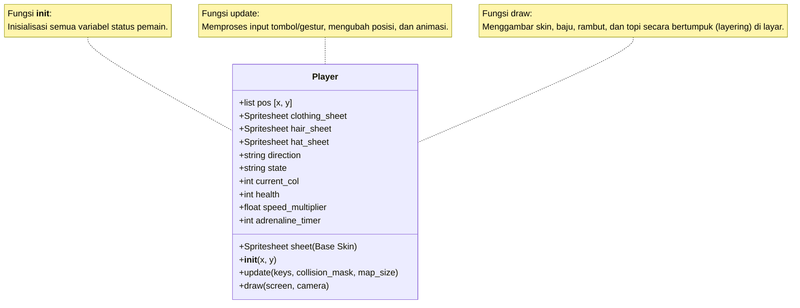
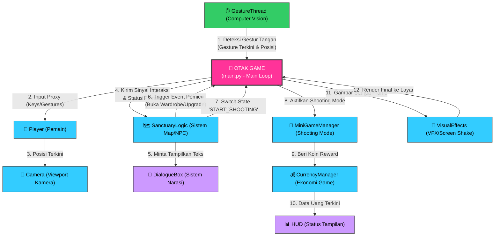

# 🧠 Arsitektur & Alur Aliran Game (City Under Attack)

Dokumen ini menjelaskan struktur kode game Anda secara visual menggunakan flowchart dan diagram. Penjelasan dibagi menjadi 3 level abstraksi sesuai dengan request Anda:

1. **Dari Per-Baris (Line-by-Line) Menjadi Satu Kesatuan yaitu `main()`**
2. **Dari Beberapa Fungsi Menjadi Satu Kelas (Function-to-Class Composition)**
3. **Dari Beberapa Kelas Menjadi Satu "Otak" Game (Class-to-Brain Integration)**

---

## 🚀 1. Dari Per-Baris (Line-by-Line) Menjadi Satu Kesatuan yaitu `main()`
Diagram di bawah ini memetakan **setiap baris dan blok kode** secara spesifik di dalam file [main.py](file:///home/abuyyy/PemogramanLanjut/main.py), menunjukkan bagaimana baris-baris kode tersebut terstruktur dan dieksekusi mengalir hingga menjadi satu kesatuan di fungsi `main()`.

```mermaid
flowchart TD
    %% Styling
    classDef start_node fill:#ff4444,stroke:#333,stroke-width:2px,color:#fff;
    classDef block_init fill:#ffaa00,stroke:#333,stroke-width:1px,color:#000;
    classDef block_loop fill:#00aa00,stroke:#333,stroke-width:2px,color:#fff;
    classDef branch fill:#cc55ff,stroke:#333,stroke-width:1px,color:#fff;
    classDef render fill:#0088ff,stroke:#333,stroke-width:1px,color:#fff;

    %% Entry point
    L549["[Baris 549-551] Entry Point:<br>if __name__ == '__main__': main()"]:::start_node --> L21["[Baris 21] Panggil def main()"]:::start_node

    %% Inisialisasi
    subgraph Inisialisasi ["Fase Inisialisasi Awal (Baris 22-151)"]
        L21 --> L22["[Baris 22-28] Pygame Setup:<br>pygame.init(), display.set_mode(), clock"]:::block_init
        L22 --> L30["[Baris 30-47] Instansiasi Objek:<br>Player, Camera, DialogueBox, Currency, HUD, VFX, SanctuaryLogic"]:::block_init
        L30 --> L48["[Baris 48-53] Multi-threading CV:<br>Inisialisasi & Start GestureThread"]:::block_init
        L48 --> L55["[Baris 55-114] Wardrobe Customization Data:<br>Skin, Outfit, Hair, Hat Options & Indices"]:::block_init
        L55 --> L115["[Baris 115-125] Weapon Upgrade Data:<br>Upgrade costs & status levels"]:::block_init
        L115 --> L126["[Baris 126-151] Helper Function & Sync:<br>update_player_wardrobe() & sync awal"]:::block_init
    end

    %% Loop
    L126 --> L154["[Baris 154] while True: (Game Loop Utama)"]:::block_loop

    subgraph Loop_Frame ["Proses per Frame (Baris 155-548)"]
        L154 --> L155["[Baris 155-159] Frame Timing & Sensor Read:<br>dt = clock.tick(60), get_pressed(), gesture_thread"]:::block_loop
        
        %% Cabang Wardrobe
        L155 --> L161{"[Baris 161] Apakah<br>wardrobe_active == True?"}:::branch
        L161 -- "Ya" --> L162["[Baris 162-194] Handle Key Event Wardrobe<br>(Ganti baju/kulit/topi/rambut)"]:::block_loop
        L162 --> L195["[Baris 195-308] Draw Background + Overlay Wardrobe Menu"]:::render
        L195 --> L308["[Baris 308-309] display.flip() & continue"]:::render
        L308 --> L154

        %% Cabang Upgrade
        L161 -- "Tidak" --> L312{"[Baris 312] Apakah<br>upgrade_shop_active == True?"}:::branch
        L312 -- "Ya" --> L313["[Baris 313-332] Handle Key Event Upgrade Shop<br>(Beli Damage/Ammo/Reload/Rate)"]:::block_loop
        L313 --> L334["[Baris 334-457] Draw Background + Overlay Upgrade Menu"]:::render
        L334 --> L457["[Baris 457-458] display.flip() & continue"]:::render
        L457 --> L154

        %% Cabang Minigame
        L312 -- "Tidak" --> L463{"[Baris 463] Apakah<br>minigame_manager.in_minigame == True?"}:::branch
        L463 -- "Ya" --> L464["[Baris 464-487] Handle Input Minigame:<br>Mouse / Smooth Hand Gesture & Recoil/Shoot"]:::block_loop
        L464 --> L488["[Baris 488-490] Update & Draw Active Shooting Game"]:::render
        L488 --> L490["[Baris 490-491] display.flip() & continue"]:::render
        L490 --> L154

        %% Cabang Default (Eksplorasi)
        L463 -- "Tidak" --> L494["[Baris 494-506] Event Handling Mode Petualangan:<br>Lacak tombol QUIT & ENTER untuk dialog"]:::block_loop
        L494 --> L508["[Baris 508-513] Input Mapping (Keyboard + CV):<br>Mapping Gestur ATAS/BAWAH/KIRI/KANAN/PISTOL"]:::block_loop
        L508 --> L516{"[Baris 516] Apakah<br>dialogue.active == False?"}:::branch
        
        %% Update Logic Eksplorasi
        L516 -- "Ya (Dialog Tidak Aktif)" --> L517["[Baris 517-518] Update Fisika Pemain & Kamera:<br>player.update() & camera.update()"]:::block_loop
        L517 --> L521["[Baris 521-531] Update Misi/NPC SanctuaryLogic:<br>Kembalikan sinyal start shooting/koin/wardrobe"]:::block_loop
        L516 -- "Tidak (Sedang Dialog)" --> L533["Lewati update pemain, fokus ke dialog"]:::block_loop
        
        %% Render Akhir Eksplorasi
        L521 --> L533["[Baris 533-535] Render Map & Karakter:<br>draw_ground(), draw_entities(), player.draw()"]:::render
        L533 --> L538["[Baris 538-540] Render Overlay UI:<br>VFX flash, dialogue box, HUD senter"]:::render
        L538 --> L543["[Baris 543-545] Render Status Text / Objektif Misi"]:::render
        L543 --> L547["[Baris 547] pygame.display.flip()"]:::render
        L547 --> L154
    end
```

---

## 📦 2. Dari Beberapa Fungsi Menjadi Satu Kelas
Bagian ini menunjukkan bagaimana **Data/State** dan **Fungsi-Fungsi** yang tersebar dikemas menjadi satu kesatuan di dalam kelas [Player](file:///home/abuyyy/PemogramanLanjut/src/entities/player.py). Semua fungsi di dalam kelas berinteraksi menggunakan parameter internal (`self`).

### Penjelasan Hubungan Fungsi & Data di dalam Class:
1. **`self` (Jembatan Data)**: Variabel seperti `self.pos`, `self.direction`, dan `self.current_col` adalah data bersama. 
2. **`update()` Mengubah Data**: Fungsi ini membaca input keyboard/gestur dan **mengubah** data posisi (`self.pos`) serta indeks animasi (`self.current_col`).
3. **`draw()` Membaca Data**: Fungsi ini dipanggil setelah `update()` untuk membaca data terkini (`self.pos`, `self.direction`, `self.current_col`) dan **merendernya** ke layar menggunakan Pygame.

---

## 🧠 3. Dari Beberapa Kelas Menjadi Satu "Otak" Game (Central Brain)
Inilah arsitektur tertinggi game Anda. **Otak** dari game Anda adalah **Game Loop & Orchestrator** yang berada di dalam [main.py](file:///home/abuyyy/PemogramanLanjut/main.py) pada fungsi `main()`. Fungsi ini mengatur aliran data antar kelas yang berbeda agar saling bekerja sama.

### Deskripsi Aliran Kerja "Otak" Game:
* **Pengumpul Sensor ([GestureThread](file:///home/abuyyy/PemogramanLanjut/comvis/gestures.py))**: Berjalan di thread latar belakang untuk memproses input kamera lewat MediaPipe secara real-time. Hasilnya dikirim ke **Otak Game** berupa nama gestur (seperti `"ATAS"`, `"PISTOL"`) dan koordinat tangan.
* **Koordinator Input**: **Otak Game** membungkus input keyboard dan gestur kamera menjadi satu proxy input (`InputProxy`) lalu meneruskannya ke kelas [Player](file:///home/abuyyy/PemogramanLanjut/src/entities/player.py).
* **Pengelola State & Event ([SanctuaryLogic](file:///home/abuyyy/PemogramanLanjut/src/core/sanctuary_logic.py))**: Menghitung interaksi pemain dengan dunia (seperti api unggun, kasur medis, NPC Kapten Jaka/Penatua Aris, helipad supply drop). Jika terjadi event khusus, ia mengirimkan sinyal string ke **Otak Game** (contoh: `"START_SHOOTING"`, `"OPEN_WARDROBE"`, `"AWARD_150_BRONZE"`).
* **Peralihan Mode ([MiniGameManager](file:///home/abuyyy/PemogramanLanjut/src/core/minigame_manager.py))**: Ketika menerima sinyal `"START_SHOOTING"`, **Otak Game** menghentikan rendering eksplorasi dan mengalihkan kendali penuh ke mode pertempuran FPS melawan zombie.
