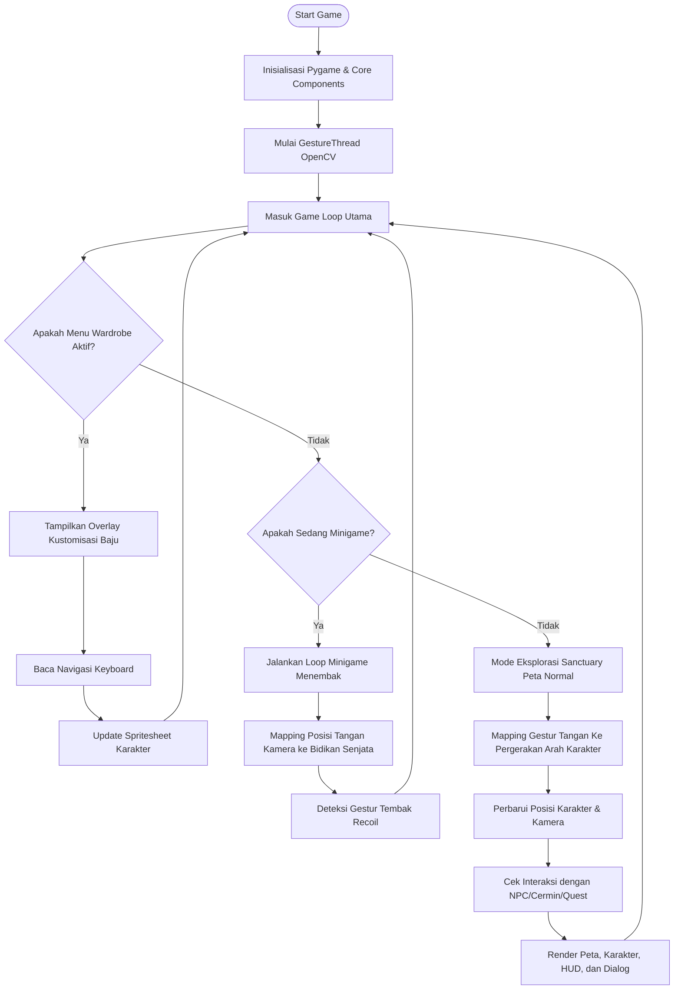

# Penjelasan Detil main.py - City Under Attack (Sanctuary Defense)

Dokumen ini berisi penjelasan baris demi baris dari file `main.py` dalam bahasa Indonesia. Penjelasan ini dirancang untuk membantu Anda memahami arsitektur program dan alur logika permainan untuk persiapan demo/persentasi.

---

## Deskripsi & Tujuan File

`main.py` adalah titik masuk utama (entry point) dari permainan **City Under Attack - Sanctuary Defense**. Tugas utama file ini meliputi:
1. **Inisialisasi Pygame & Layar Game:** Menyiapkan window beresolusi 720p (1280x720) dan mengelola clock FPS (dibatasi 60 FPS).
2. **Inisialisasi Komponen Utama:** Menyiapkan kamera, HUD, sistem mata uang (Currency), efek visual, dialog NPC, dan logika peta Sanctuary (`SanctuaryLogic`).
3. **Integrasi Computer Vision (Gestur):** Menjalankan thread terpisah (`GestureThread`) untuk membaca gerakan tangan dari kamera, lalu memetakan gestur tersebut ke kontrol game.
4. **Fitur Kustomisasi Karakter (Wardrobe):** Mengatur menu interaktif untuk memilih varian kulit (skin), pakaian (outfit), rambut (hair), dan topi (hat) dengan sistem spritesheet berlapis (layered spritesheet).
5. **Manajer Minigame:** Mengontrol transisi masuk dan keluar dari mode minigame latihan menembak (Shooting Range) dengan menggunakan *proxy pattern* untuk meminimalkan ketergantungan antar kelas.

---

## Daftar Import

Berikut adalah modul-modul yang diimpor pada bagian awal program:

*   **`import pygame`**: Pustaka utama untuk rendering grafis, penanganan event input, suara, dan perulangan game.
*   **`import sys`**: Digunakan untuk menghentikan program Python secara bersih ketika game ditutup (`sys.exit()`).
*   **`from src.entities.player import Player`**: Mengimpor kelas `Player` yang mengontrol posisi, gerakan, rendering, dan status karakter pemain.
*   **`from src.ui.dialogue import DialogueBox`**: Mengimpor kelas kotak dialog untuk menampilkan teks cerita atau interaksi dengan NPC.
*   **`from src.ui.hud import HUD`**: Mengimpor Heads-Up Display untuk menggambar informasi antarmuka seperti sisa daya senter dan jumlah koin di layar.
*   **`from src.core.currency import CurrencyManager`**: Mengimpor kelas pengelola keuangan game (koin Bronze, Silver, Gold).
*   **`from src.core.camera import Camera`**: Mengimpor sistem kamera dinamis yang mengikuti pergerakan pemain agar area peta yang besar bisa ditampilkan secara bergeser (scrolling).
*   **`from src.core.visual_effects import VisualEffects`**: Mengimpor kelas untuk memproses efek visual layar, contohnya efek kilatan cahaya (flash effect).
*   **`from src.core.minigame_manager import MiniGameManager`**: Mengimpor sistem yang mengatur jalannya minigame agar terpisah dari alur eksplorasi utama.
*   **`from src.core.sanctuary_logic import SanctuaryLogic`**: Mengimpor kelas logika dunia Sanctuary (peta, NPC, interaksi quest, dll).
*   **`from comvis.gestures import GestureThread`**: Mengimpor thread Computer Vision berbasis OpenCV/MediaPipe untuk mendeteksi gestur tangan secara asinkron.

---

## Penjelasan Baris Demi Baris

Di bawah ini adalah penjelasan detail untuk setiap bagian kode pada `main.py`:

| Baris | Kode Sumber | Penjelasan (Bahasa Indonesia) |
| :--- | :--- | :--- |
| **1-11** | `import pygame`, `import sys`, ... | Mengimpor pustaka standar Python, modul utama Pygame, komponen-komponen inti game (Player, DialogueBox, HUD, Camera, dll), serta thread pendeteksi gestur tangan dari folder `comvis`. |
| **14-20** | `class InputProxy:`   `    def __init__(self, keys_pressed):`   ... | **Desain Pattern Proxy:** Kelas pembungkus untuk memetakan input keyboard. Berguna agar input dari kamera (gestur tangan) dapat berpura-pura menjadi tombol keyboard (`overrides`) tanpa harus merusak struktur logika input di kelas `Player`. |
| **21** | `def main():` | Fungsi utama yang membungkus seluruh jalannya program game. |
| **23** | `pygame.init()` | Menginisialisasi seluruh sub-modul Pygame yang diperlukan (seperti display, font, dan sound). |
| **24-26** | `WIDTH, HEIGHT = 1280, 720`   `screen = pygame.display.set_mode(...)`   `pygame.display.set_caption(...)` | Mengatur dimensi layar game sebesar 1280x720 piksel (resolusi HD/720p), membuat canvas display, dan memberikan judul pada window game. |
| **27** | `clock = pygame.time.Clock()` | Membuat objek clock untuk membatasi framerate (FPS) dan mengukur perbedaan waktu antar frame (`delta time`). |
| **28** | `font = pygame.font.SysFont("monospace", 14)` | Menyiapkan font sistem jenis monospace berukuran 14pt untuk merender teks status di bagian bawah layar. |
| **31** | `player = Player(500, 450)` | Membuat objek pemain (`Player`) dan menempatkannya pada koordinat awal x=500 dan y=450 di dalam map. |
| **32** | `camera = Camera(WIDTH, HEIGHT, 2560, 1440)` | Menginisialisasi kamera dengan ukuran layar 1280x720 dan ukuran peta dunia Sanctuary sebesar 2560x1440 piksel. |
| **33-36** | `dialogue = DialogueBox()`   `currency = CurrencyManager()`   `hud = HUD(currency)`   `effects = VisualEffects(WIDTH, HEIGHT)` | Menginisialisasi elemen UI (dialog dan HUD), sistem manajemen koin, serta manajer efek visual layar. |
| **39** | `game_logic = SanctuaryLogic(dialogue)` | Membuat objek logika game Sanctuary yang menangani penempatan NPC, quest, dan memicu dialog saat interaksi. |
| **41** | `dialogue.box_rect = pygame.Rect(100, 500, 1080, 150)` | Menyesuaikan posisi dan ukuran kotak dialog agar posisinya pas di bagian bawah layar untuk resolusi 1280x720. |
| **44-46** | `class EngineProxy:`   `    def __init__(self, s, c, cur): ...`   `minigame_manager = MiniGameManager(...)` | **EngineProxy:** Objek perantara sederhana yang dibagikan ke `MiniGameManager` agar minigame memiliki akses ke layar (`screen`), clock, dan keuangan (`currency`) tanpa perlu mengimpor kelas utama secara melingkar (*circular imports*). |
| **49-50** | `gesture_thread = GestureThread(0)`   `gesture_thread.start()` | Membuat thread baru untuk Computer Vision menggunakan kamera indeks 0 (webcam bawaan), lalu menjalankannya di latar belakang agar tidak memblokir render game (asinkron). |
| **52-53** | `smoothed_hx = WIDTH // 2`   `smoothed_hy = HEIGHT // 2` | Variabel untuk menyimpan posisi tangan yang telah dihaluskan (smooth), diletakkan pertama kali di tengah layar. |
| **56-60** | `SKIN_OPTIONS = [...]`   `SKIN_NAMES = [...]` | Daftar path file gambar spritesheet dasar untuk karakter (11 jenis warna kulit manusia) beserta nama tampilannya untuk menu wardrobe. |
| **62-91** | `OUTFIT_OPTIONS = [...]`   `OUTFIT_NAMES = [...]` | Daftar opsi pakaian (outfit) yang bisa dipasang di atas kulit karakter. Berisi pakaian kosong (`None`), seragam Forester, celana petani, dan celana boxer. |
| **93-100** | `HAIR_OPTIONS = [...]`   `HAIR_NAMES = [...]` | Membuat daftar opsi gaya rambut dengan perulangan otomatis (menggunakan format `zfill` untuk mencocokkan nama file spritesheet gaya rambut Bob Cut dan Dapper). |
| **102-110** | `HAT_OPTIONS = [...]`   `HAT_NAMES = [...]` | Membuat daftar opsi topi (seperti topi jerami petani atau topi penyihir) menggunakan perulangan otomatis berdasarkan penamaan file aset. |
| **111-113** | `wardrobe_active = False`   `wardrobe_category = 0`   `wardrobe_indices = [0, 3, 23, 0]` | Variabel status menu wardrobe: `wardrobe_active` (apakah menu sedang terbuka), `wardrobe_category` (kategori item yang dipilih: 0=Kulit, 1=Baju, 2=Rambut, 3=Topi), dan indeks default untuk masing-masing kategori. |
| **115-138** | `def update_player_wardrobe():` | Fungsi lokal untuk memperbarui spritesheet karakter pemain. Fungsi ini memuat ulang gambar skin, pakaian, rambut, dan topi yang dipilih dari array opsi ke objek `player`. |
| **140** | `update_player_wardrobe()` | Memanggil fungsi kustomisasi sekali di awal agar visual pemain langsung terinisiasi dengan benar sebelum perulangan utama dimulai. |
| **143** | `while True:` | **Game Loop Utama:** Loop tak terbatas yang berjalan terus menerus selama game aktif. |
| **144** | `dt = clock.tick(60) / 16.67` | Membatasi framerate maksimum game di 60 FPS dan menghitung `dt` (Delta Time) relatif terhadap target 60Hz (~16.67 milidetik per frame) untuk memastikan pergerakan tetap konsisten terlepas dari variasi FPS. |
| **145** | `events = pygame.event.get()` | Mengambil antrean event input dari sistem operasi (seperti klik mouse, tombol keyboard ditekan, atau menutup jendela). |
| **146-147** | `current_g = gesture_thread.current_gesture`   `h_pos = gesture_thread.hand_pos` | Mengambil data gestur aktif terakhir dan koordinat normalisasi tangan (0.0 sampai 1.0) dari thread kamera OpenCV. |
| **150** | `if wardrobe_active:` | **Blok Logika Menu Wardrobe:** Jika menu wardrobe aktif, game akan fokus pada input dan tampilan pemilihan baju, serta menunda jalannya simulasi dunia luar. |
| **151-155** | `for event in events:`   `    if event.type == pygame.QUIT:`   `        gesture_thread.stop()`   `        gesture_thread.join(...)`   `        pygame.quit(); sys.exit()` | Menangani penutupan jendela game saat menu wardrobe aktif. Sangat penting untuk memanggil `.stop()` dan `.join()` pada thread OpenCV agar program tidak menggantung (hang) di latar belakang sistem operasi. |
| **156-180** | `if event.type == pygame.KEYDOWN:`   `    if event.key == pygame.K_UP: ...` | Menangani penekanan tombol panah pada keyboard untuk navigasi wardrobe: Atas/Bawah memindahkan kategori; Kiri/Kanan mengganti item yang dipilih; kemudian memanggil `update_player_wardrobe()` untuk memperbarui visual karakter secara langsung. |
| **181-182** | `elif event.key == pygame.K_RETURN:`   `    wardrobe_active = False` | Menekan tombol Enter akan menutup menu kustomisasi wardrobe dan kembali ke petualangan biasa. |
| **184-190** | `game_logic.draw_ground(screen, camera)`   `...`   `hud.draw(screen, player, 100)` | Menggambar dunia Sanctuary di latar belakang agar saat menu wardrobe terbuka, pemain tetap dapat melihat posisi karakternya di peta. |
| **192-201** | `overlay_w, overlay_h = 720, 440`   `ox = (WIDTH - overlay_w) // 2`   ...   `screen.blit(s, (ox, oy))` | Membuat permukaan (`Surface`) transparan berwarna gelap dengan border warna cyan bercahaya di tengah layar sebagai wadah panel UI menu wardrobe. |
| **203-214** | `font_title = ...`   `title_surf = ...`   `pygame.draw.line(...)` | Menyiapkan font-font khusus wardrobe dan menggambar judul menu beserta garis dekorasi pembatas. |
| **216-224** | `pygame.draw.rect(screen, ...)`   `preview_lbl = ...`   `pygame.draw.ellipse(screen, ...)` | Menggambar area khusus pratinjau (preview) karakter di sebelah kiri panel, lengkap dengan bayangan pedestal elips cyan sebagai pijakan karakter. |
| **227-230** | `preview_timer = getattr(...) + 1`   `preview_col = (preview_timer // 8) % 6`   `preview_row = 4` | Membuat animasi berjalan statis menghadap ke bawah (`preview_row = 4`) untuk pratinjau karakter dengan mengganti indeks frame kolom spritesheet setiap 8 tick game secara melingkar (modulo 6). |
| **232-239** | `preview_surf = pygame.Surface(...)`   `preview_surf.blit(...)` | **Layered Rendering:** Menggambar karakter pratinjau secara bertumpuk. Kulit digambar paling bawah, disusul pakaian, rambut, lalu topi di bagian teratas. |
| **241-242** | `scaled_preview = pygame.transform.scale(...)`   `screen.blit(scaled_preview, ...)` | Memperbesar gambar pratinjau karakter berukuran pixel-art asli (32x32 piksel) menjadi 160x160 piksel agar terlihat jelas di layar, lalu menampilkannya. |
| **244-250** | `categories = [...]` | Mendefinisikan label kategori menu beserta nama opsi yang sedang aktif saat ini untuk dirender di sisi kanan panel. |
| **252-276** | `for idx, (cat_name, opt_name) in enumerate(categories):`   `...` | Melakukan iterasi untuk menggambar setiap kategori. Jika kategori tersebut adalah kategori yang sedang disorot/dipilih pemain (`is_selected`), sistem akan menggambar latar belakang cyan terang dengan tingkat transparansi tinggi. Jika tidak, digambar dengan warna abu-abu redup. |
| **277-289** | `lbl_surf = ...`   `opt_text = ...`   `screen.blit(...)` | Menggambar teks nama kategori dan nama opsi item. Jika terpilih, teks opsi akan diberi indikator panah navigasi kiri-kanan (◀ dan ▶). |
| **290-295** | `pygame.draw.line(...)`   `help_text = ...`   `screen.blit(...)` | Menggambar panduan kontrol tombol di bagian paling bawah panel menu wardrobe. |
| **297-298** | `pygame.display.flip()`   `continue` | Memperbarui tampilan layar (double buffering) dan menggunakan perintah `continue` untuk langsung melompati sisa kode game loop agar sisa logika game di bawah tidak berjalan saat menu wardrobe terbuka. |
| **300** | `interact_pressed = False` | Menginisialisasi ulang status interaksi menjadi `False` di awal setiap frame petualangan. |
| **303** | `if minigame_manager.in_minigame:` | **Blok Logika Minigame:** Mengecek apakah pemain sedang berada di dalam minigame (mode latihan menembak). |
| **304-308** | `for event in events:`   `    if event.type == pygame.QUIT:`   `        ...` | Menangani event penutupan game dan penutupan thread CV saat berada dalam minigame. |
| **309-310** | `elif event.type == pygame.MOUSEMOTION:`   `    smoothed_hx, smoothed_hy = event.pos` | Jika ada pergerakan mouse fisik, posisi bidik target menembak akan langsung mengikuti koordinat kursor mouse tersebut. |
| **311** | `minigame_manager.active_game.handle_event(event)` | Meneruskan event Pygame (seperti klik mouse) ke kelas minigame yang sedang aktif agar dapat merespons tembakan secara mandiri. |
| **314-320** | `if current_g != "None":`   `    target_hx = ...`   `    lerp_factor = 0.40`   `    smoothed_hx = ...` | **Smoothing Pergerakan Tangan:** Jika mendeteksi ada gestur tangan dari kamera, posisi tangan yang dinormalisasi akan dikonversi ke koordinat layar. Dengan rumus *Linear Interpolation* (LERP) dengan faktor 0.40, pergerakan bidikan target tangan akan terasa sangat halus (smooth) layaknya pergerakan kursor mouse tanpa patah-patah. |
| **322-323** | `fake_move = pygame.event.Event(...)`   `minigame_manager.active_game.handle_event(fake_move)` | Membuat event pergerakan mouse buatan (*mock event*) berdasarkan koordinat tangan hasil deteksi kamera, lalu meneruskannya ke minigame agar bidikan di minigame dapat diarahkan dengan tangan. |
| **325-326** | `if gesture_thread.recoil_active:`   `    minigame_manager.active_game.handle_event(...)` | Jika thread kamera mendeteksi gerakan kejutan sentakan tangan (gestur menembak/pistol dilepas dengan cepat atau recoil), buat event klik kiri buatan untuk menembakkan peluru dalam game. |
| **328-331** | `minigame_manager.update(dt)`   `minigame_manager.draw()`   `pygame.display.flip()`   `continue` | Memperbarui fisika peluru/musuh minigame, menggambar tampilan minigame ke layar, meng-update display, lalu melompati loop petualangan utama. |
| **334-338** | `for event in events:`   `    if event.type == pygame.QUIT:`   `        ...` | Menangani penutupan program game secara aman saat berada dalam mode eksplorasi peta normal. |
| **339-345** | `if event.type == pygame.KEYDOWN:`   `    if dialogue.active:`   `        if event.key == pygame.K_RETURN:`   `            dialogue.next_message()`   `    else:`   `        if event.key == pygame.K_RETURN:`   `            interact_pressed = True` | Menangani input tombol Enter saat berpetualang: Jika sedang mengobrol dengan NPC (dialog aktif), tombol Enter akan melanjutkan ke baris teks berikutnya. Jika sedang berjalan bebas, menekan Enter akan mengaktifkan tombol interaksi untuk berinteraksi dengan NPC atau objek terdekat. |
| **348** | `keys = InputProxy(pygame.key.get_pressed())` | Membuat objek `InputProxy` untuk membaca seluruh tombol keyboard yang sedang ditekan saat ini. |
| **349-353** | `if current_g == "ATAS": ...`   `elif current_g in ["PISTOL", "AMBIL", "ENTER"]: interact_pressed = True` | **Pemetaan Gestur ke Kontrol Game:** Jika kamera mendeteksi gestur tangan menunjuk ke arah "ATAS", "BAWAH", "KIRI", atau "KANAN", proxy input akan dimanipulasi seolah-olah tombol panah keyboard yang sesuai sedang ditekan. Gestur berbentuk "PISTOL", "AMBIL", atau "ENTER" juga dipetakan langsung sebagai tindakan interaksi (menekan tombol Enter). |
| **356** | `if not dialogue.active:` | Jika pemain tidak sedang terjebak dalam percakapan dialog, logika permainan diperbolehkan untuk diperbarui. |
| **357** | `player.update(keys, map_size=(2560, 1440))` | Memperbarui pergerakan, arah hadap, animasi frame, dan membatasi posisi pemain agar tidak keluar dari batas peta Sanctuary (2560x1440 piksel). |
| **358** | `camera.update(player.pos)` | Memperbarui posisi kamera agar terpusat pada posisi koordinat pemain (kamera mengikuti pemain secara dinamis). |
| **361** | `signal = game_logic.update(player, interact_pressed)` | Memperbarui logika dunia (posisi NPC, mendeteksi apakah pemain berada di zona interaksi NPC). Hasil interaksi mengembalikan sebuah string sinyal (`signal`). |
| **362-364** | `if signal == "START_SHOOTING":`   `    from src.core.minigames.shooting_range import ShootingRangeUltimate`   `    minigame_manager.start_minigame(...)` | Jika interaksi memicu sinyal latihan menembak, program akan memuat minigame `ShootingRangeUltimate` ke manajer minigame untuk memulai transisi permainan menembak. |
| **365-366** | `elif signal == "AWARD_150_BRONZE":`   `    currency.add_bronze(150)` | Jika sinyal adalah penerimaan hadiah, sistem keuangan akan menambahkan 150 koin Bronze ke penyimpanan pemain. |
| **367-368** | `elif signal == "OPEN_WARDROBE":`   `    wardrobe_active = True` | Jika berinteraksi dengan cermin/lemari kustomisasi, ubah status `wardrobe_active` menjadi `True` untuk menampilkan menu kustomisasi baju di frame berikutnya. |
| **371-373** | `game_logic.draw_ground(screen, camera)`   `game_logic.draw_entities(screen, camera, player)`   `player.draw(screen, camera)` | **Rendering Utama:** Menggambar lapisan tanah peta Sanctuary, disusul entitas lingkungan/NPC berdasarkan kedalaman kamera, lalu menggambar karakter pemain di atasnya. |
| **376-378** | `effects.draw_flash(screen)`   `dialogue.draw(screen)`   `hud.draw(screen, player, 100)` | Menggambar efek visual, merender kotak dialog (jika sedang aktif), dan menggambar HUD di bagian pojok kiri atas (senter diset 100% penuh untuk versi demo). |
| **381-383** | `status = game_logic.get_status_text()`   `pygame.draw.rect(screen, (0,0,0,150), ...)`   `screen.blit(font.render(status, ...), ...)` | Mendapatkan teks petunjuk objektif misi aktif saat ini dari `game_logic`, menggambar kotak hitam transparan di bawah layar sebagai latar belakang teks, lalu merender teks tersebut. |
| **385** | `pygame.display.flip()` | Menukar buffer layar (*double buffering*) untuk memperbarui gambar yang baru saja dirender ke monitor pemain agar tidak terjadi efek berkedip (*flickering*). |
| **387-388** | `if __name__ == "__main__":`   `    main()` | Kondisi standar Python untuk memastikan fungsi `main()` dijalankan hanya jika file ini dijalankan secara langsung sebagai program utama, bukan saat diimpor oleh modul lain. |

---

## Alur Kerja Utama (Logic Flow)

Secara umum, alur eksekusi `main.py` mengalir sebagai berikut:
1. **Fase Persiapan:** Pygame diinisialisasi, objek entities (`player`) dan logika (`game_logic`) dibangun. Thread gestur OpenCV (`GestureThread`) diluncurkan di background agar pengenalan gambar tidak menghentikan frame rate game.
2. **Game Loop:** Loop berjalan di 60 FPS. Di setiap frame, program mendeteksi state aktif permainan:
    *   Jika menu **Wardrobe** aktif: Layar hanya menggambar menu kustomisasi baju di atas visual game lama. Pemain bisa mengganti skin/baju dengan tombol arah dan menekan Enter untuk menyimpannya.
    *   Jika **Minigame** aktif: Loop utama melimpahkan kontrol event dan update frame ke `minigame_manager`. Koordinat tangan dari OpenCV dihaluskan dengan teknik LERP agar kursor bidikan senjata menembak bergerak dengan mulus.
    *   Jika **Eksplorasi Normal** aktif: Karakter bergerak menggunakan keyboard atau gestur fisik (ATAS, BAWAH, KIRI, KANAN). Logika mendeteksi tabrakan atau interaksi dengan NPC. Jika ada interaksi khusus, game memicu dialog cerita, memberikan koin, atau memicu perubahan ke mode minigame menembak / wardrobe.
3. **Penyajian Frame:** Layar digambar ulang secara berlapis (ground -> NPC/Environment -> Player -> UI/HUD -> Status Text) lalu diproyeksikan ke monitor menggunakan fungsi `pygame.display.flip()`.
