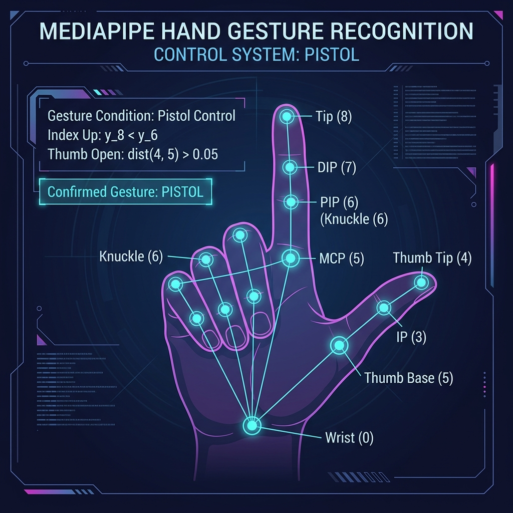
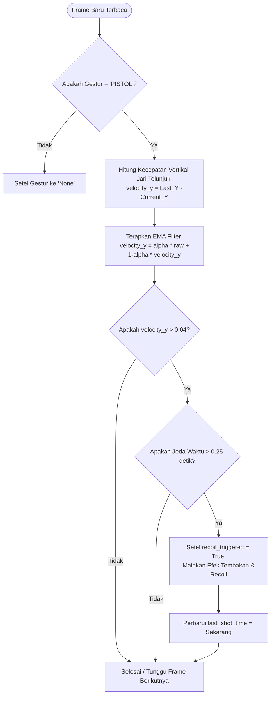

# 🔫 Visualisasi Logika Gestur Pistol (PISTOL Gesture)

Dokumen ini menjelaskan visualisasi geometris dan logika pemrograman dari gestur **"PISTOL"** yang digunakan untuk menembak dalam game *Sanctuary Defense*.

---

## 🎨 Visualisasi MediaPipe Landmarks

Gambar di bawah ini mengilustrasikan titik-titik sendi tangan (*landmarks*) yang dilacak oleh MediaPipe beserta formula deteksinya:

---

## 📐 Penjelasan Aturan Geometris (Rule-Based Heuristic)

Untuk mengklasifikasikan tangan sebagai gestur `"PISTOL"`, sistem memeriksa dua kondisi utama secara bersamaan:

| Kondisi | Formula Matematika | Penjelasan Teknis |
| :--- | :--- | :--- |
| **Telunjuk Tegak ke Atas** | `y_8 < y_6` | Koordinat Y dari **Ujung Telunjuk (8)** harus lebih kecil dari **Sendi PIP Telunjuk (6)**. Karena koordinat Y pada layar komputer dimulai dari `0` di bagian paling atas, nilai Y yang lebih kecil menandakan posisi yang lebih tinggi di dunia nyata. |
| **Ibu Jari Terbuka/Lebar** | `dist(4, 5) > 0.05` | Jarak Euclidean antara **Ujung Ibu Jari (4)** dan **Pangkal Jari Telunjuk / MCP (5)** harus lebih besar dari batas ambang `0.05` (sekitar 5% lebar/tinggi bidang tangkapan kamera). Ini memastikan jempol tidak menekuk ke dalam telapak tangan. |

---

## 🔄 Alur Logika Pemicu Tembakan (Recoil & Cooldown)

Setelah gestur terdeteksi sebagai `"PISTOL"`, game tidak langsung menembak secara konstan. Pemain harus menyentakkan tangannya ke atas (mensimulasikan sentakan recoil senjata) untuk menembakkan sebutir peluru.

Berikut adalah diagram alur keputusan pemicuan tembakan (*firing trigger state*):

> [!TIP]
> **Mengapa menggunakan filter EMA (Exponential Moving Average)?**
> Filter ini menghaluskan grafik perubahan koordinat sehingga getaran kecil dari tangan pemain tidak terbaca secara salah sebagai gerakan sentakan menembak yang tidak disengaja.

---

## 🔗 Referensi Kode Terkait
* Definisi Gestur: [gestures.py#L60-L71](../comvis/gestures.py#L60-L71)
* Deteksi Kecepatan & Recoil: [gestures.py#L168-L182](../comvis/gestures.py#L168-L182)
* Penjelasan Dokumentasi Asli: [gestures.md](./gestures.md)
